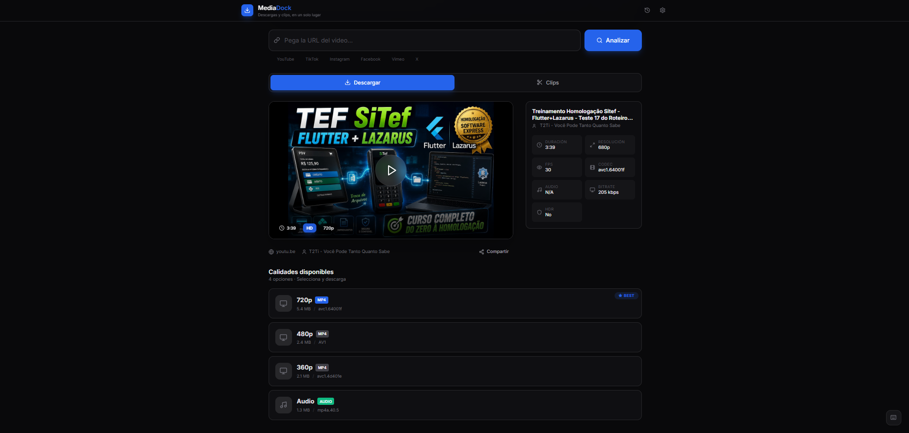
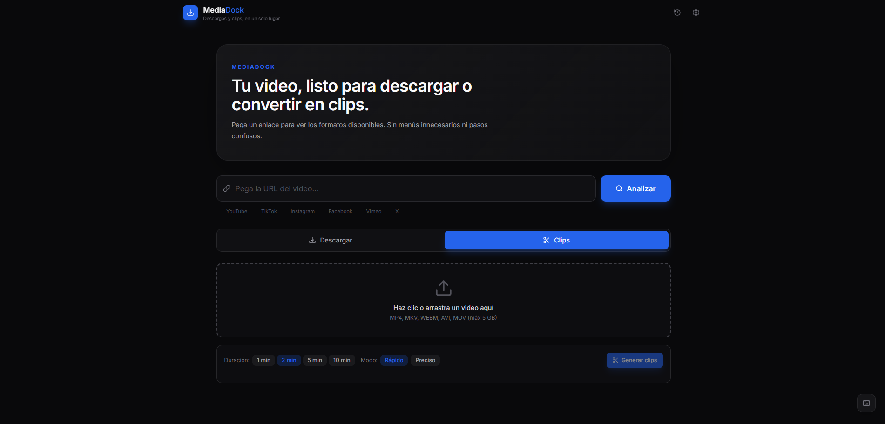

# MediaDock

Aplicación web para analizar enlaces de video, descargar formatos disponibles y generar clips de forma simple.

## Vistas

### Descargar un video

Analiza un enlace, consulta la información disponible y elige la calidad o pista de audio que quieres descargar.



### Generar clips

Puedes crear clips desde una URL o subir un archivo. El progreso muestra las etapas del trabajo y añade cada clip a la pantalla cuando está listo.



## Características

- Análisis de URLs mediante `yt-dlp` y extractores dedicados.
- Metadatos del video: título, miniatura, duración, canal, códec, FPS y bitrate.
- Descarga de video o audio en los formatos disponibles.
- Progreso de descarga y posibilidad de cancelarla.
- Generación de clips desde URL o archivo local.
- Estado de clips en tiempo real: preparación, descarga, segmentación y finalización.
- Historial local de descargas, atajos de teclado y mensajes de error claros.
- Interfaz oscura, responsive y accesible, con animaciones reducidas cuando el sistema lo solicita.

## Arquitectura

```text
Frontend (React + Vite)  ──HTTP──>  Backend (Express + TypeScript)
                                        ├─ yt-dlp: análisis y descarga
                                        └─ FFmpeg: segmentación y miniaturas
```

El frontend puede desplegarse como sitio estático. El backend necesita un entorno donde estén instalados `yt-dlp` y FFmpeg.

## Requisitos

- Node.js 20 o superior
- pnpm
- `yt-dlp` para análisis y descargas reales
- FFmpeg para crear clips y miniaturas

En Windows puedes instalar `yt-dlp` con:

```powershell
winget install yt-dlp.yt-dlp
```

Instala FFmpeg según tu sistema y verifica que ambos comandos estén disponibles en el `PATH`.

## Instalación

```powershell
git clone https://github.com/Naiker12/MediaDock.git
cd MediaDock
pnpm install
```

Para desarrollo, abre dos terminales:

```powershell
# Terminal 1
pnpm frontend:dev

# Terminal 2
pnpm backend:dev
```

La interfaz estará disponible en `http://localhost:5173` y la API en `http://localhost:3001`.

> En PowerShell, si `pnpm` queda bloqueado por la política de scripts, usa `pnpm.cmd` o abre una terminal nueva después de instalarlo.

## Comandos

| Comando | Descripción |
| --- | --- |
| `pnpm frontend:dev` | Inicia Vite en el puerto 5173. |
| `pnpm frontend:build` | Comprueba TypeScript y genera el build del frontend. |
| `pnpm backend:dev` | Compila e inicia el backend en modo desarrollo. |
| `pnpm backend:build` | Compila el backend TypeScript. |
| `pnpm backend:start` | Inicia el backend compilado. |

## API

### `POST /api/analyze`

Obtiene metadatos y formatos disponibles.

```json
{ "url": "https://www.youtube.com/watch?v=dQw4w9WgXcQ" }
```

### `POST /api/download`

Descarga el formato seleccionado.

```json
{ "url": "https://www.youtube.com/watch?v=dQw4w9WgXcQ", "qualityId": "22" }
```

### `POST /api/clip`

Inicia la generación de clips desde una URL. Devuelve un trabajo (`jobId`) que se consulta hasta terminar.

```json
{ "url": "https://www.youtube.com/watch?v=dQw4w9WgXcQ", "clipDuration": 120, "mode": "fast" }
```

### `POST /api/clip/upload`

Genera clips desde un archivo de video con `multipart/form-data`. Tamaño máximo: 5 GB.

### `GET /api/clip/:jobId/status`

Devuelve el estado del trabajo y los clips generados hasta ese momento.

### `GET /health`

```json
{ "status": "ok", "timestamp": "2026-08-14T00:00:00.000Z" }
```

## Uso responsable

Descarga solo contenido propio, de dominio público o para el que tengas autorización. Respeta los derechos de autor y las condiciones de cada plataforma.
